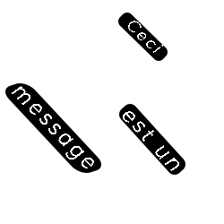
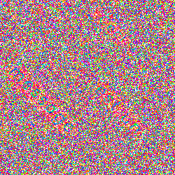

# AnaglyphGenerator

## Introduction

Génère une image contenant un message secret qui peut être lu avec des lunettes 3D (verre rouge).

## Utilisation
Télécharger la dernière release du projet [ici](https://github.com/EPFL-SPS/AnaglyphGenerator/releases). Elle est composée de trois fichier: le `.exe` à exécuter sur Windows, un fichier `message.png` qui est un masque du message à convertir et le fichier Photoshop source `message.psd`. 

Le masque est un fichier `PNG` composé de trois couches, en **blanc** les pixels du texte, en **noir** l'arrière plan du texte pour le détacher du fond qui lui est **transparent**.

Démarrer l'executable puis suivre les consignes affichées. Les chemins à entrer pour le fichier source et destination sont relatifs au répertoire où se situe le programme.

Au besoin le programme peut être lancé en tant que script Python en démarrant [main.py](./main.py) avec les dépendances mentionnées [ici](#dépendances). 

## Comment ça marche ?

Lorsque le spectre est observé à travers le verre rouge de lunettes 3D, il est décomposé en trois spectres. Deux seront perçus comme blancs (rouges sur le schéma) et un en noir. 

L'image encodée est elle décomposée en trois parties:
- Le fond d'écran dont les pixels sont choisis au hasard dans les trois spectres.
- Les pixels derrière le texte qui sont choisis dans les deux spectres qui ressortiront en blanc.
- Les pixels du texte qui sont choisis dans le spectre qui ressortira noir.

 

Ce code est basé sur la vidéo [Math Constructed - Secret Anaglyph Message Generator](https://www.youtube.com/watch?v=zPa-ukzHilk) et le [code Javascript](https://www.khanacademy.org/computer-programming/secret-anaglyph-message/5395038998921216). 

## Dépendances
- [Pillow](https://pypi.org/project/Pillow/) - Fork de Python Imaging Library (PIL) à jour

## Troubleshooting

Si le programme ne démarre pas correctement ou qu'il doit être utilisé sur Mac, téléchargez le code et exécutez [main.py](./main.py) en prenant soin d'installer les [dépendances nécessaires](#dépendances).